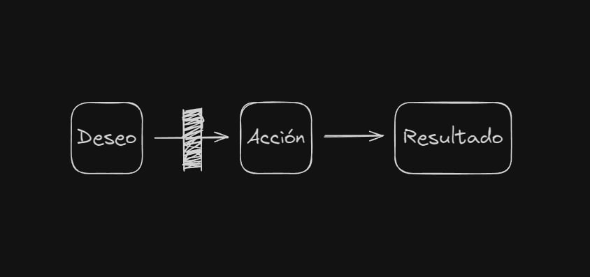
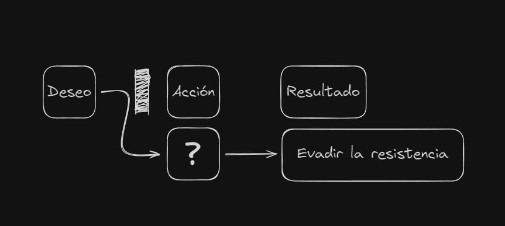
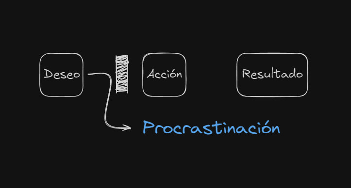

Often, finding the motivation to do a task you don't feel like doing seems almost impossible. You may feel incapable, not know where to start, be afraid to begin, or find it so boring that you always leave it for later. Regardless of the reason, it all ends up the same: "I'll do it later," "I'll finish it tomorrow." So today, I bring you some clarity on the matter so you can deal with these problems and combat the famous procrastination once and for all.

## Definition

Before diving fully into the content, let's first look at the definition: **Procrastination** (from Latin _procrastinare_: _pro_, forward, and _crastinus_, tomorrow), **postponement**, or **deferment** is the action or habit of delaying activities or situations that need to be addressed, replacing them with other more irrelevant or pleasant situations due to fear of facing them or laziness in carrying them out.

It's a volitional behavioral disorder rooted in the association of the action to be performed with change, pain, or discomfort (stress). This can be psychological (in the form of anxiety or frustration), physical (such as that experienced during acts requiring hard work or vigorous exercise), or intellectual. The term is commonly applied to the sense of anxiety generated by a pending task without having the willpower to complete it. The act that is postponed can be perceived as overwhelming, challenging, disturbing, dangerous, difficult, tedious, or boring—that is, stressful—which is why postponing it to an idealized future _sine die_ is self-justified, where the important is subordinated to the urgent.

## Why do we procrastinate?

Now that we know what we mean by procrastinating, it's time to ask ourselves: If I already know what I have to do and how I should do it, why don't I start? Or why don't I finish that project I left half-done a week ago? What exactly is preventing me from completing or carrying out certain tasks? To answer all these questions, we must do a **functional analysis of behavior** (a technique used in behavioral psychology that seeks to understand the causes and consequences of specific behavior).

It is vitally important to keep this in mind because nobody acts simply because. If a behavior appears, it's because it serves a function; therefore, if you procrastinate, it's because it serves you somehow. That is, when you choose to postpone a pending task, it's usually not because you're "lazy," but because in a specific context, under certain conditions, postponing that task serves a function.

As we all know, each person is different; therefore, the contexts, conditions, and functions will be different in each case. So the main thing here is to know how to identify what our context is, what the cause of our actions is, and what function it is fulfilling in our specific case. From there, we can develop a strategy taking all this into account.

## How does motivation work?

**Motivation** is what explains why people or animals initiate, continue, or end certain behavior at a given time. Let's take Walter White in "Breaking Bad" as an example. How is it possible that a high school chemistry teacher, with no criminal experience, is motivated to enter the dangerous world of drug trafficking, face drug cartels, hitmen, and the DEA, and all that simply to cook methamphetamine? Obviously, if you put it that way, it doesn't make much sense. But if you think that manufacturing and selling that methamphetamine results in securing his family's financial future before dying of cancer, things change quite a bit. The result of that action is something Walter desperately desires. Every action we take is because it implies a result, and we desire that result.

Walter is motivated to manufacture and sell methamphetamine because it means earning enough money to support his family after his death, and he desperately wants that to happen.

These are the three main elements to understand motivation: desire, action, and result. Only when they are aligned does _motivation_ arise. If they are not aligned or one is directly missing, then motivation immediately extinguishes or does not appear.

It doesn't make sense for Walter White to enter the world of drug trafficking if we think that all he's doing is cooking methamphetamine (excluding the reason that led to his desire and the result he wants to obtain). In this case, we would be presenting only the action without really determining what its result is. Of course, it's impossible to desire that result if it doesn't even exist in your head.

Now let's imagine the opposite case where we propose a result but the action is not clear. That is, we tell Walter that there is a way to secure his family's financial future; however, we don't tell him how to do it. In this case, it would even be possible for desire to appear, but since there is no clear action to channel it, motivation doesn't arise either. One of the elements is still missing.

And now let's imagine that we clearly determine the action, that is, manufacturing and selling methamphetamine, and we also determine the result, which is to earn enough money for his family. But it turns out that Walter, instead of being a man desperate for his family's future, is an exemplary citizen without financial problems. There would be no desire to achieve this result through this action and, therefore, motivation would not arise either.

What needs to be understood about this issue is that it's impossible to be motivated towards anything if these three elements are not present and aligned with each other. In Walter White's case, we see how they align perfectly:

1. **Desire**: Secure his family's future before dying.
2. **Action**: Manufacture and sell methamphetamine.
3. **Result**: Earn a large amount of money in a short time.

This alignment is what drives Walter to make drastic decisions and transform from an ordinary chemistry teacher into the infamous Heisenberg. As the series progresses, we see how these elements evolve, but always remaining aligned, which maintains Walter's motivation even when his actions become increasingly extreme. But beware, because it's not enough for these three elements to be aligned; it's also essential that we feel capable and perceive the result as something possible.

Surely you know some cases where someone clearly doesn't have the capabilities to do something, but is still highly motivated to try. Most likely, later on, they will encounter their true possibilities, but until that moment comes, if they think there is a possible result to achieve, desire that result, and feel capable of achieving it through a certain action, they will continue motivated as if there were no tomorrow.

On the other hand, the opposite case is also common: people who have impressive talent but, for whatever reason, think they are not capable and don't even try. No matter how clear one sees it from the outside, if that person doesn't feel that something is possible or doesn't feel capable of doing it, they won't be motivated to try it. Therefore, **_motivation depends_** largely **_on perception_**, **_not reality_**.

So far, we have seen _almost_ the complete formula for how to stop procrastinating or how to be motivated. I say "almost" because there's still a very important fourth element missing. This last one is responsible for not carrying out an action, even when you have a strong desire for a certain result and you have clear the necessary action to achieve it.

We'll call this fourth element **Resistance**. This factor acts as a barrier that stands between Desire and Action.

Well, it turns out that resistance can manifest in various forms. For example:

1. If the action is clear and possible, but seems difficult or dangerous to us, resistance takes the form of anxiety.
2. When the action is complex, resistance presents itself as confusion, which occurs when we don't know where to start.
3. If the action is monotonous and not very stimulating, resistance manifests as boredom.

These are just a few examples, but resistance can take many other forms. In short, this is usually a type of emotion that we don't know very well how to deal with. The real problem arises when that emotion is so strong that it changes the **Desire**: we go from wanting the original result to seeking the result of an alternative action, _that of avoiding resistance_.

And as you already know, the name given to the action of avoiding resistance is **Procrastination**.

Many times, what happens when we procrastinate is not that we are not motivated, but that we are motivated in a different direction, seeking a new result, which is to _avoid resistance_. Well, now you're probably wondering, **"And what solution can we give to this?"** Most of the time, we perceive procrastination as something bad, an evil that definitely needs to be eradicated, but in reality, procrastination is nothing more than a symptom of a disease. But... What disease? Yes, you guessed it: **Resistance**.

So if we don't eliminate the disease, the symptom will never disappear. To eliminate resistance, we must first know how to identify what type it is, what form it's taking in our specific case, and depending on the case, then learn or develop an alternative strategy to deal with that resistance that is more efficient than procrastinating.

## Overcoming Procrastination

In summary, we've learned that procrastination is not simply laziness, but a symptom of underlying resistance. To overcome this obstacle, it's crucial to:

1. Identify the key elements of motivation: desire, action, and result.
2. Recognize the specific form our resistance takes (anxiety, confusion, boredom, etc.).
3. Develop personalized strategies to handle that resistance.

Remember, the key is not to eliminate procrastination directly, but to address the resistance that causes it. By doing so, you'll not only improve your productivity but also better understand your behavior patterns and motivations.

The path to productivity and personal fulfillment is not always easy, but with the right tools and a deeper understanding of our mental processes, we can overcome procrastination and achieve our goals.

And you, what form of resistance have you identified in your life? What strategies do you plan to implement to overcome it? Remember, every small step counts in the journey towards a more productive and satisfying life.

Go ahead, it's time to take action!
