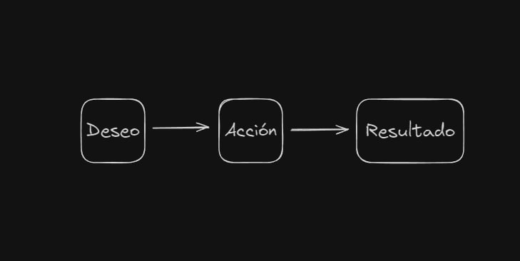
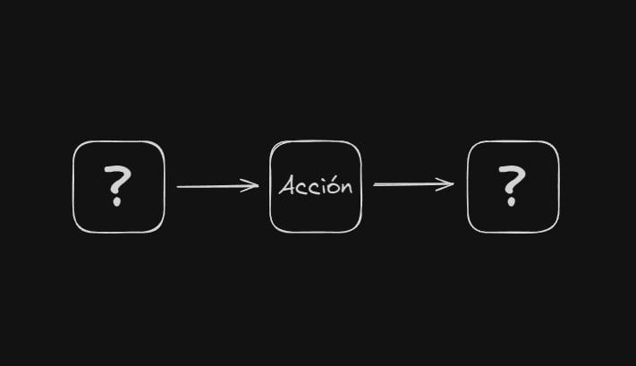
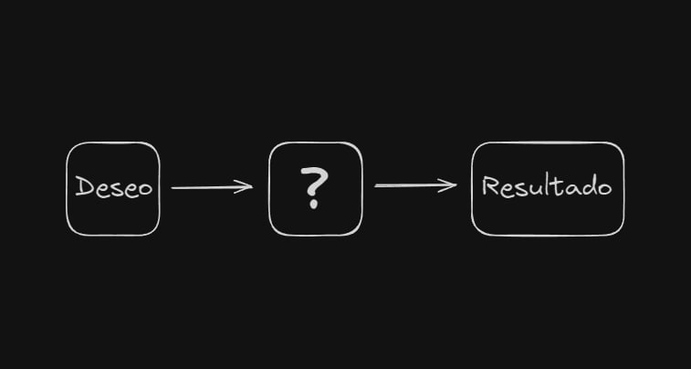
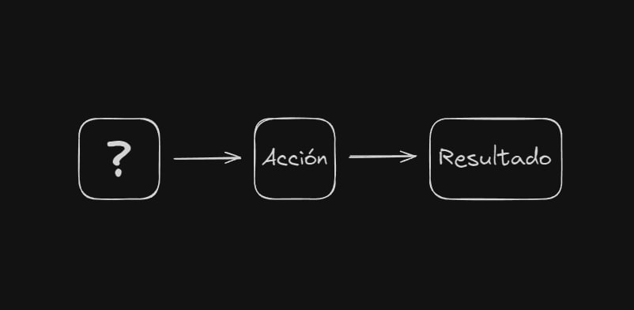

A menudo encontrar la motivación para hacer una tarea que no te apetece parece casi imposible, puede que te sientas incapaz, que no sepas por donde empezar, que te de miedo empezarla o que sea tan aburrido que siempre la dejas para después. Independientemente al final todo acaba en lo mismo: "Más tarde lo hago", "Mañana lo termino". Así que hoy te traigo un poco de claridad en el asunto para que puedas lidiar con estos problemas y combatir de una vez por todas a la famosa procrastinación...
## Definición

Antes de adentrarnos de lleno en el contenido primero veamos la definición: La **procrastinación** (del [latín](https://es.wikipedia.org/wiki/Lat%C3%ADn "Latín") _procrastinare_: _pro_, adelante, y _crastinus_, mañana),​ **postergación** o **posposición** es la acción o hábito de retrasar actividades o situaciones que deben atenderse, sustituyéndolas por otras situaciones más irrelevantes o agradables por miedo a afrontarlas o pereza a realizarlas.

Trata de un trastorno [volitivo](https://es.wikipedia.org/wiki/Volitivo "Volitivo") del comportamiento que tiene su raíz en la asociación de la acción por realizar con el cambio, el dolor o la incomodidad ([estrés](https://es.wikipedia.org/wiki/Estr%C3%A9s "Estrés")). Este puede ser psicológico (en la forma de [ansiedad](https://es.wikipedia.org/wiki/Ansiedad "Ansiedad") o [frustración](https://es.wikipedia.org/wiki/Frustraci%C3%B3n "Frustración")), físico (como el que se experimenta durante actos que requieren trabajo fuerte o ejercicio vigoroso) o intelectual. El término se aplica comúnmente al sentido de [ansiedad](https://es.wikipedia.org/wiki/Ansiedad "Ansiedad") generado ante una tarea pendiente sin tener una fuerza de voluntad para concluirla. El acto que se pospone puede ser percibido como abrumador, desafiante, inquietante, peligroso, difícil, tedioso o aburrido, es decir, estresante, por lo cual se autojustifica posponerlo a un futuro _[sine die](https://es.wikipedia.org/wiki/Sine_die "Sine die")_ idealizado, en que lo importante es supeditado a lo urgente.
## ¿Por qué procrastinamos?

Bien, ahora que ya sabemos a que nos referimos con _procrastinar_ es hora de preguntarnos: ¿Si ya sé qué es lo que tengo que hacer y como debo hacerlo por qué no lo empiezo? o ¿Por qué no termino ese proyecto que dejé a medias hace una semana? ¿Qué es exactamente lo que me impide completar o llevar a cabo ciertas tareas? Para responder a todas estas interrogantes debemos hacer un **análisis funcional de la conducta**, que es una técnica utilizada en la psicología conductual que busca comprender las causas y consecuencias de un comportamiento específico, esto es de vital importancia tenerlo en cuenta porque nadie actúa simplemente porque sí, si aparece una conducta es porque esta cumple una función, por lo tanto, si tú procrastinas es porque te sirve de algo, es decir, cuando elijes posponer una tarea que tienes pendiente no suele ser porque eres "flojo", sino porque en un contexto determinado bajo ciertas condiciones la postergación de dicha tarea cumple una función.

Como todo sabemos cada persona es diferente por lo tanto estos contextos, condiciones y funciones van a ser diferentes para cada persona, por lo tanto lo principal aquí es saber identificar cuál es nuestro contexto, cuál es la causa de nuestro accionar y que función esta cumpliendo en nuestro caso específicamente y de ahí elaborar un estrategia teniendo todo esto en cuenta.
## ¿Cómo funciona la motivación?

La **motivación** es lo que explica por qué las personas o los animales inician, continúan o terminan un cierto comportamiento en un momento determinado. Pongamos como ejemplo a Walter White en "Breaking Bad". ¿Cómo es posible que un profesor de química de secundaria, sin experiencia criminal, esté motivado a adentrarse en el peligroso mundo del narcotráfico, enfrentarse a cárteles de la droga, asesinos a sueldo y la DEA, y todo eso simplemente para cocinar metanfetamina? Evidentemente, si lo planteas así, no tiene mucho sentido. Pero si piensas que fabricar y vender esa metanfetamina tiene como resultado asegurar el futuro financiero de su familia antes de morir de cáncer, la cosa cambia bastante. El resultado de esa acción es algo que Walter desea con mucha fuerza.

Toda acción que realizamos es porque implica un resultado y deseamos dicho resultado.

Walter está motivado a fabricar y vender metanfetamina porque eso implica ganar suficiente dinero para mantener a su familia después de su muerte, y él quiere desesperadamente que eso ocurra.

Estos son los tres elementos principales para entender la motivación; deseo, acción y resultado y solo cuando están alineados es cuando surge la _motivación_ y si no están alineados o directamente falta alguno, pues la motivación inmediatamente se extingue o no aparece.

No tiene sentido que Walter White se adentre en el mundo del narcotráfico si pensamos que lo único que está haciendo es cocinar metanfetamina (excluyendo el motivo que llevó a su deseo y el resultado que quiere obtener). En este caso, estaríamos presentando únicamente la acción sin determinar realmente cuál es su resultado. Claro, es imposible desear dicho resultado si este directamente ni siquiera existe en tu cabeza.

Ahora imaginemos el caso opuesto en el que planteamos un resultado pero no está clara la acción. Es decir, le decimos a Walter que hay una forma de asegurar el futuro financiero de su familia, pero no le determinamos cómo hacerlo. En este caso sería incluso posible que apareciese el deseo, pero como no hay una acción clara para canalizarlo, pues tampoco surge la motivación. Sigue faltando uno de los elementos.

Y ahora imaginemos que determinamos claramente la acción, es decir, fabricar y vender metanfetamina, y determinamos también el resultado, que es ganar suficiente dinero para su familia. Pero resulta que Walter, en lugar de ser un hombre desesperado por el futuro de su familia, es un ciudadano ejemplar sin problemas económicos. No habría deseo en conseguir este resultado a través de esta acción y, por tanto, tampoco surgiría la motivación.

Lo que hay que entender de esta cuestión es que es imposible estar motivado hacia nada si estos tres elementos no están presentes y alineados entre sí. En el caso de Walter White, vemos cómo estos tres elementos se alinean perfectamente:

1. **Deseo**: Asegurar el futuro de su familia antes de morir.
2. **Acción**: Fabricar y vender metanfetamina.
3. **Resultado**: Ganar una gran cantidad de dinero en poco tiempo.

Esta alineación es lo que impulsa a Walter a tomar decisiones drásticas y a transformarse de un profesor de química común en el infame Heisenberg. A medida que la serie avanza, vemos cómo estos elementos evolucionan, pero siempre manteniéndose alineados, lo que mantiene la motivación de Walter incluso cuando sus acciones se vuelven cada vez más extremas.